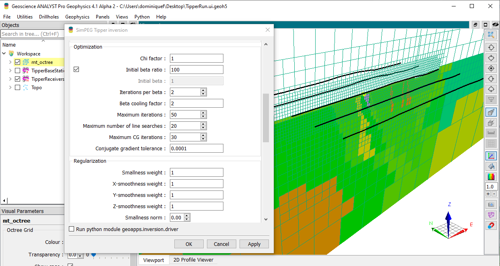

Fundamentals
============

This module documents the use of `SimPEG <https://simpeg.xyz/>`__ for
geophysical data inversion with user-interface (UIjson) made available
through the `Mira
Geoscience-geoapps <https://mirageoscience-geoapps.readthedocs-hosted.com/>`__
project. While the code itself has its own documentation, there is a
need to demonstrate the effect of parameters controlling the inversion.
This document is meant to be a reference guide with practical examples
to help practitioners with their inversion work.

- `Background <background>`__: An overview of the inversion framework.

- `Data Fit <data_misfit>`__: Assigning uncertainties and global target
  (data misfit).

- `Regularization (Constraints) <regularization>`__: Adding modeling
  constraints (regularization).

- `Mesh Design <mesh_design>`__: Designing an inversion mesh.

- `Joint/Coupling Strategies <joint_inversion>`__: Inverting multiple
  geophysical surveys.

- `Depth of Investigation <depth_of_investigation>`__: Using
  sensitivities to set depth extents

   inversion_ui
