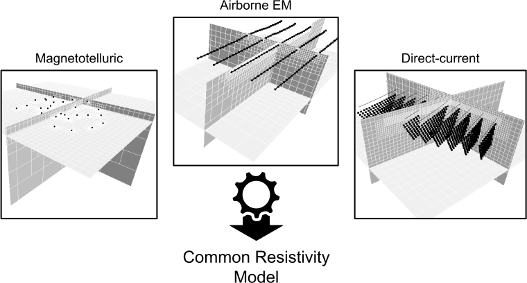
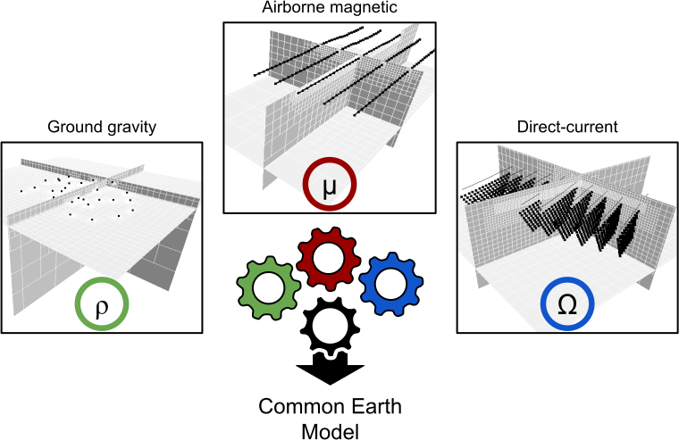

Joint Inversion
===============

This section introduces the methodology to invert multiple datasets
jointly. The goal of a joint inversion is to invert for a
``Common Earth Model`` based on multiple geophysical surveys that might
provide complementary information.

In its simplest form, a joint inversion can be performed on multiple
surveys that are sensitive to the same physical property. For example,
one could invert a magnetotelluric survey and a direct-current
resistivity survey together for a single resistivity model. This kind of
joint inversion does not require a coupling term - simply the summation
of multiple misfit functions. More details about this ``joint surveys``
inversion strategy can be found in the :doc:`joint_inversion/joint_surveys` section.

   Joint survey inversion

The more general joint inversion strategy tries to find commonality
between multiple physical properties models. For example, one could
invert a direct-current resisitivity survey for the thickness of
overburden, along with a gravity survey to highlight the density of
targets under cover. Multiple geophysical surveys may be sensitive to
different components of the sub-surface. Complementary information about
the position and shape of physical property contrasts can help in
reducing ambiguity inherent to geophysical inversion.

   Joint physical property inversion

This kind of joint inversion requires a ``coupling`` term in order to
tie those physical properties together. The following strategies are
available through the SimPEG framework {cite:p}\ ``heagy_2017``:

- :doc:`joint_inversion/cross_gradient`
- :doc:`joint_inversion/pgi`
