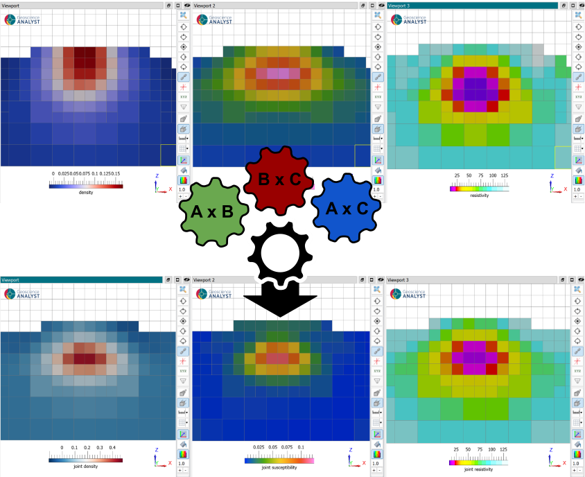

# Joint Cross Gradient Inversion

The joint cross-gradient inversion strategy allows to find commonality
between multiple physical property models by minimizing the
cross-product of their spatial gradients. This method is particularly
useful when inverting for different physical properties that are
expected to have similar spatial structure.

<figure class="align-center">

</figure>

For example, a geological intrusion might be associated with a magnetic,
gravity and/or electrical anomaly, corresponding to changes in magnetic
susceptibility, density or resistivity compared to the host rocks. In
this case, the edges of the magnetic, density or resistivity models
should be aligned, even if the physical property values are different.
By minimizing the cross-gradient of the two models, we can encourage the
inversion to find a common structure in both models even in regions
where some survey types may be less sensitive

## Background

The `cross-gradient` regularization was first introduced by
{cite:p}`gallardo2003` to constrain electrical resistivity and seismic
velocity inversions, but the same strategy applies to any physical
property models. As the name states, the method employs the cross
product on the spatial gradients of models such that

$$\phi_c(\mathbf{m_A},\mathbf{m_B}) = \sum_{i=1}^{M} \| \nabla \mathbf{m_A}_i \times \nabla \mathbf{m_B}_i \|^2$$

where $\nabla \mathbf{m_A}$ and $\nabla \mathbf{m_B}$ are the gradients
for two distinct physical properties (density, magnetization components,
resitivity, etc.). Since the cross-product of two vectors is also a
vector, we use the total length (l2-norm) of the cross-product. The
constraint is small (no impact) if the gradients of the models are
either aligned or zero. Conversely, the measure becomes large if edges
in the physical models are perpendicular with each other. Since we are
attempting to minimize this function, this constraint will force model
boundaries to occur at the same location or not at all.

The full regularization function for the joint cross-gradient inversion,
with conventional Tikhonov regularization for each model, becomes

$$\phi_m = \sum_{i=s,x,y,z} \alpha_i^A \| \mathbf{W}_i^A \mathbf{m_A} \|^2 + \sum_{i=s,x,y,z} \alpha_i^B \| \mathbf{W}_i^B \mathbf{m_B} \|^2 + \alpha_c \phi_c(\mathbf{m_A},\mathbf{m_B})$$

made up of nine terms in total: four for each model and one
cross-gradient term.

It is possible to constrain more than two physical property models by
adding multiple cross-gradient terms for every pair of models such that

$$\phi_c(\mathbf{m_A},\mathbf{m_B}, \mathbf{m_C}) = \alpha_{AB} \phi(\mathbf{m_A},\mathbf{m_B}) + \alpha_{AC}\phi(\mathbf{m_A},\mathbf{m_C}) + \alpha_{BC} \phi(\mathbf{m_B},\mathbf{m_C})$$

and so on. Each term has a scaling parameter ($\alpha$) to control the
importance of specific cross-gradient terms. Further automated rescaling
is available, as explained in the `iterative_scaling`{.interpreted-text
role="ref"} section.

## Interface

The joint cross-gradient inversion user requires a list of standalone
inversion groups as input

### Input parameters

-

  `Joint groups`:

  :   Standalone inversion groups to be included in the joint inversion.
      Up to three groups can be included in the joint inversion, but
      only two are required. Each group should be defined as a
      standalone inversion problem, with its own survey and mesh.

-

  `Misfit scales`:

  :   For each standalone inversion group, a scaling factor to be
      applied to the misfit function. This allows to scale the
      uncertainties of individual surveys.

-

  `Coupling scales`:

  :   For each pair of models, a scaling factor to be applied to the
      cross-gradient function. This allows to control the importance of
      specific cross-gradient terms.

-

  `Iterative rescaling`:

  :   Optional iterative rescaling of the coupling terms relative to
      other components of the regularization function. More details
      provided in the `iterative_scaling`{.interpreted-text role="ref"}
      section.

-

  `Mesh`:

  :   The mesh to be used for the joint inversion. If not supplied, a
      common mesh will be created by merging the meshes of the
      standalone inversion groups. The meshes of the standalone
      inversion groups must be compatible with each other, meaning that
      they must cover the same spatial extent and have a similar base
      cell size. The global mesh will include the finest resolution of
      all standalone meshes, such that the interpolation from the global
      mesh to the individual meshes is as accurate as possible (fine to
      coarse).

### Advanced parameters

By default, the regularization parameters of the standalone inversions
are used, allowing for maximum flexibility in controlling the character
of individual models. Otherwise, when the `Regularization` group is
activate, global parameters can be used across all the
sub-regularization functions for more consistent behaviour.

All other parameters related to the optimization of the standalone
inversions are overridden by the joint inversion framework.

#### Iterative re-scaling {#iterative_scaling}

#### Auto-scaling of misfit functions

By default, an auto-scaling of the misfit functions is applied at each
iteration, such that the contribution of each survey to the model update
is balanced. This is particularly important when the surveys have
different units or sensitivities. More details about the auto-scaling
strategy can be found in the `misfit_scaling`{.interpreted-text
role="ref"} section.
