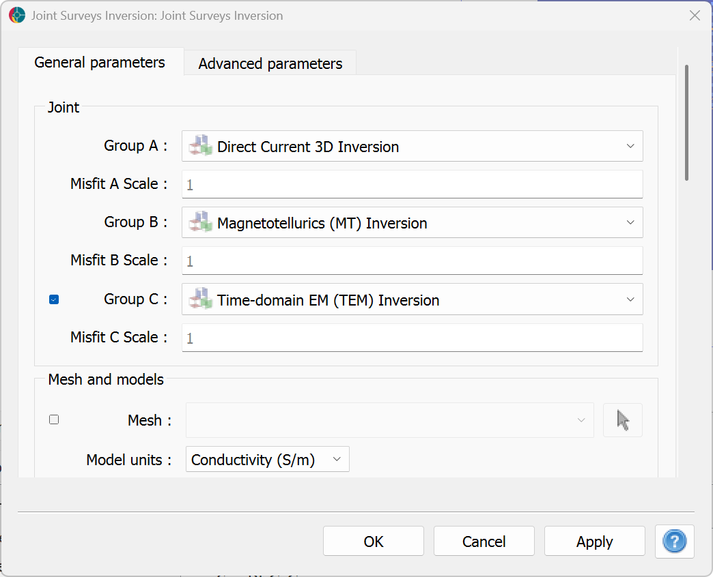
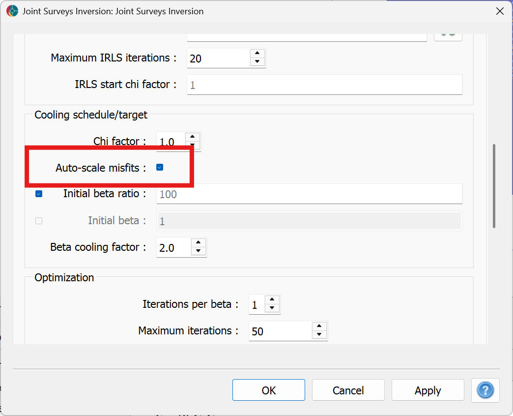

Joint Surveys Inversion
=======================

The ``joint surveys`` inversion framework allows to invert multiple
datasets at once for a single physical property model. The goal is to
combine complementary information from various geophysical surveys that
sense the Earth differently.

.. figure:: ../images/joint_survey.svg
   :align: center
   :width: 500pt

For example, a magnetotelluric survey is mostly sensitive to deep
structures but can still be affected by local changes in resistivity
near the sensor locations. A ground direct-current survey on the other
hand is highly sensitive to near surface changes in resistivity.
Inverting both surveys together would provide complementary information
that improves our modeling capabilities overall.

Background
----------

The joint survey inversion does not require a coupling term - simply
the summation of multiple misfit functions influencing the same model.
The global misfit function becomes

.. math::

   \phi_d = \phi_d^A + \phi_d^B + ...

or

.. math::

   \phi_d = \sum_{j=A, B, C} \phi_d^j

Since each misfit tries to update the same model values, the partial
derivatives of each function is also a summation, such that

.. math::


   \frac{\delta \phi_d}{\delta m} = \sum_{j=A, B, C} \frac{\delta \phi_d^j}{\delta m}


Interface
---------

The joint survey inversion user requires a list of standalone inversion groups as input.



   Main options in the user interface for the joint survey inversion


Input parameters
^^^^^^^^^^^^^^^^

- ``Joint Groups``:
    Standalone inversion groups to be included in the joint inversion. Up to three groups can be included in the joint inversion, but only two are required.
    Each group should be defined as a standalone inversion problem, with its own survey and mesh.
    Any other regularization or optimization parameters will be ignored and overridden by the joint inversion framework.
- ``Misfit Scales``:
    For each standalone inversion group, a scaling factor to be applied to the misfit function.
    This allows to scale the uncertainties of individual surveys.
- ``Mesh``:
    The mesh to be used for the joint inversion. If not supplied, a common mesh will be created by merging the meshes of the standalone inversion groups.
    The meshes of the standalone inversion groups must be compatible with each other, meaning that they must cover the same spatial extent and have a similar base cell size.
    The global mesh will include the finest resolution of all standalone meshes, such that the interpolation from the global mesh to the individual meshes is as accurate as possible (fine to coarse).

Advanced parameters
^^^^^^^^^^^^^^^^^^^

All other parameters related to the regularization and optimization of the standalone inversions are ignored and overridden by the joint inversion framework.



   Auto-scaling of misfit functions

.. _misfit_scaling:

Auto-scaling of misfit functions
````````````````````````````````

By default, an auto-scaling of the misfit functions is applied at each iteration, such that the contribution of each survey to the model update is balanced.
This is particularly important when the surveys have different units or sensitivities. This auto-scaling strategy prevents the inversion from being dominated by a single survey, or overfitting a survey while the others are still far from their target.

The scaling factor for each survey is computed as the ratio between the achieved chi factor to the maximum chi factor of all surveys, scaled by the cooling factor of the trade-off parameter, such that

.. math::

    \text{scale}_j = 1 - (1 - \Delta\beta) \frac{\chi_{max} - \chi_j}{\chi_{max}}


where the chi factor :math:`\chi_j` for each survey is computed as the ratio between the data misfit and the number of data points:

.. math::

    \chi_j = \frac{\phi_d^j}{N_j} \,,

and :math:`\Delta \beta` is the chosen cooling factor of the trade-off parameter.
The misfit with the highest chi factor will have a scaling factor of 1, while the other misfits will have a scaling factor between :math:`\delta \beta` and 1, depending on how far their chi factor is from the maximum.
In other words, misfits with the lowest chi factors are scaled down by the same amount as the trade-off parameter, effectively canceling the cooling step as long as their chi factor is smaller.
As the inversion progresses and the chi factors of all surveys reach a similar value, the scaling factors will increase towards 1, allowing all misfits to progress towards their target.
