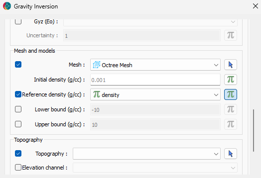
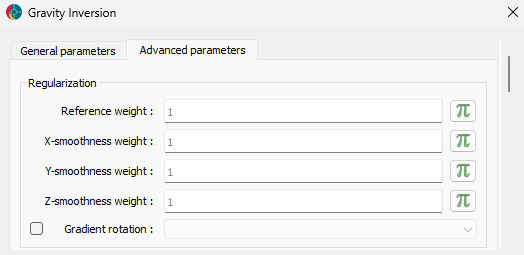

(regularization)=

Model constraints
=================

This section focuses on model constraints, or regularization functions,
that can inject “geological knowledge” into the inversion process. More
specifically, this section covers the weighted least-squares
regularization functions. Readers are invited to visit the following
sections for more advanced options

- `Sparse Lp-norms <lp-norm>`__
- `Rotate Gradients <rotated-gradients>`__

test {ref}\ ``misfit_scaling``

(l2-norm)=

Least-squares regularization
----------------------------

The conventional L2-norm regularization function imposes constraints
based on least-squares measures, either of the model and/or its spatial
gradients.

For 3D inverse problems, the full regularization function contains 4
terms: one for the reference model and three terms for the smoothness
measures along the three Cartesian axes. We can express these various
constraints as

.. math::

   \phi_m = \sum_{i = s,x,y,z} \| \mathbf{W}_i f_i(\mathbf{m}) \|_2^2

Weighting matrices :math:`\mathbf{W}_i` are added to each function to
scale the constraints among each other. While often referred to as an
*unconstrained inversion*, one could argue that the conventional
least-squares regularization does still incorporate first-degree
information about the geological background, at least in the form of
physical property distribution. The following sections provide details
on each element of the regularization.

(small-ref)=

Model smallness (reference)
~~~~~~~~~~~~~~~~~~~~~~~~~~~

In the seminal work of {cite:t}\ ``TikhonovArsenin77``, the function
:math:`f(\mathbf{m})` simply measures the deviation between the
inversion model from a reference value

.. math::

   \mathbf{f}_s = \mathbf{m} - \mathbf{m}_{ref}

where :math:`\mathbf{m}_{ref}` is a reference model. This function tries
to keep the model “small”, in terms of deviation from the reference
values. The reference model can vary in complexity, from a constant
background value to a full 3D geological representation of the physical
property.

   ref_model

(smooth-ref)=

Model smoothness (gradients)
~~~~~~~~~~~~~~~~~~~~~~~~~~~~

A second set of terms can be added to the regularization function to
apply constraints on the model gradients, or the roughness, of the
solution. Following the notation used in {cite:t}\ ``LiOldenburg1998``,

.. math::

   \mathbf{f}_i = \mathbf{G}_i (\mathbf{m} - \mathbf{m}_{ref}),

where :math:`\mathbf{G}_i` is a finite difference operator that measures
the gradient of the model :math:`\mathbf{m}` along one of the Cartesian
directions. Three functions are needed to calculate the model gradients
along the Easting (:math:`f_x`), Northing (:math:`f_y`) and vertical
(:math:`f_z`) directions. These functions enforce the model to remain
smooth, as large gradients (sharp contrasts) are penalized strongly.

(weights)=

Weights
~~~~~~~

The diagonal weighting matrices :math:`\mathbf{W}_i` are made up of
default and user-defined weights

.. math::

   \mathbf{W}_i = diag(\mathbf{w}_h * \mathbf{w}_s * \mathbf{w}_u)

User-defined weights (:math:`\mathbf{w}_u`)
^^^^^^^^^^^^^^^^^^^^^^^^^^^^^^^^^^^^^^^^^^^

User-defined weights can be tuned to emphasize the contribution of a
particular function. This can be done globally, as a constant, or
locally on a cell-by-cell basis. Weights may reflect variable degrees of
confidence in the reference geological model (e.g. high near the
surface, low at depth), or to accentuate specific trends in the model.

   reg_alphas

Sensitivity-based weights (:math:`\mathbf{w}_s`)
^^^^^^^^^^^^^^^^^^^^^^^^^^^^^^^^^^^^^^^^^^^^^^^^

Sensitivity-based weights are computed as the sum-squares the rows of
the sensitivities

.. math::

   \mathbf{w}_s = [\sum_{i=1}^{N} \mathbf{J}_{ij}^2 + \epsilon ]^{1/4} \;,

where :math:`\mathbf{J}` are the sensitivities (Jacobian) of the forward
problem. The weighting attempts to compensate for the strong influence
of the misfit function near the receiver locations, which would favour a
model with high complexity near the surface. A small constant
:math:`\epsilon` is added to threshold the weights in regions of
extremely low sensitivity.

Dimensionality scaling (:math:`\mathbf{w}_h`)
^^^^^^^^^^^^^^^^^^^^^^^^^^^^^^^^^^^^^^^^^^^^^

Dimensionality scaling is applied to the gradient terms
:math:`\phi_{i=(x,y,z)}` as constants to account for length scales in
the *smoothness* terms

.. math::

   \mathbf{w}_{hi} = h_i

where :math:`h` is defined by the smallest cell dimension in each
dimension :math:`i=x,y,z`. This default scaling brings the *smallness*
and *smoothness* terms to be dimensionally equivalent, which would
otherwise be

.. math::

   dim\; \phi_s = [m]^2, \;
   dim\; \phi_x = \frac{[m]^2}{[h]^2}

.. raw:: html

   

.. raw:: html

   

