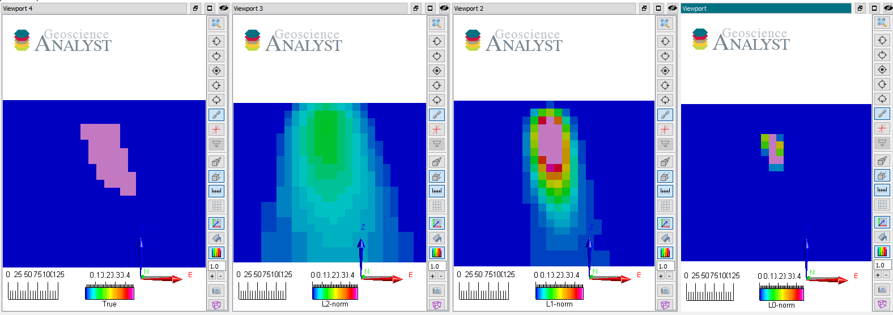
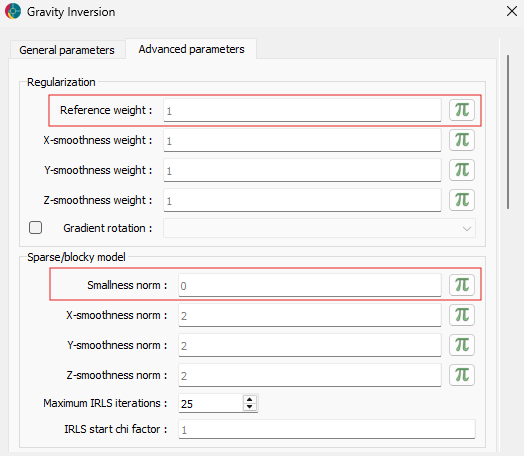
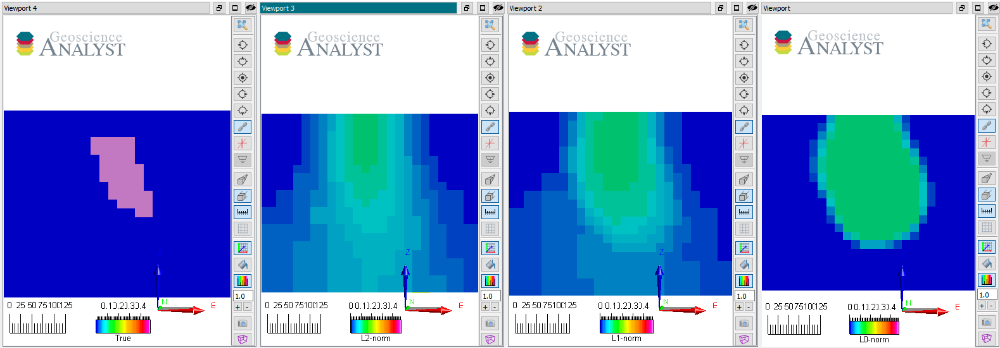
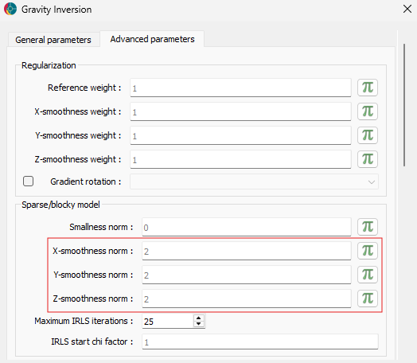
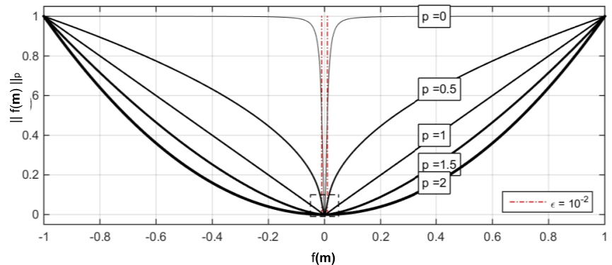

(lp-norm)=

# Sparse regularization

It is possible to generalize the conventional least-squares approach
such that we can recover different solutions with variable degrees of
sparsity. By sparsity, we mean fewer model cells (or gradients) away
from the reference, but with larger values. The goal is to explore the
model space by changing our assumption about the character of the
solution, in terms of the volume of the anomalies and the sharpness of
their edges. We can do this by changing the "ruler" by which we evaluate
the model function $f(\mathbf{m})$.

(reference-model)=

## Smallness norm model

The first option is to impose sparsity assumptions on the model values.

$$\phi(m) = \| (\mathbf{m} - \mathbf{m}_{ref}) \|_p \;.$$

That is, we ask the inversion to recover anomalies that have small
volumes but large physical property contrasts. This is desirable if we
know the geological bodies to be discrete and compact (e.g. kimberlite
pipe, dyke, etc.). The example below demonstrates the outcome of an
inversion for different combinations of norms applied to the model

*Vertical sections through the
true and recovered models (from left to right) with L2, L1 and L0-norm
on the model values.*

Note that as $p \rightarrow 0$ the volume of the anomaly shrinks to a
few non-zero elements while the physical property contrasts increase.
They generally agree on the center position of the anomaly but differ
significantly in their extent and shape.

No smoothness constraints were used ($\alpha_{x,y,z} = 0$), only a
penalty on the reference model ($m_{ref} = 0$).

All those models fit the data to the target [data misfit](data-misfit)
and are therefore valid solutions to the inversion.

(model-smoothness)=

## Smoothness norm model

Next, we explore the effect of applying sparse norms on the model
gradients.

$$\phi(m) = \| |\nabla \mathbf{m}| \|_p$$

or in matrix form

$$\phi(m) = \| \sqrt{(\mathbf{G}_x \mathbf{m})^2 + (\mathbf{G}_y \mathbf{m})^2 + (\mathbf{G}_z \mathbf{m})^2} \|_p \;.$$

In this case, we are requesting a model that has either large or no
(zero) gradients. This promotes anomalies with sharp contrast and
constant values within.

*Vertical sections through the true
and recovered models (from left to right) with L2, L1 and L0-norm on the
model gradients.*

No reference model was used ($\alpha_s = 0$) with uniform norm values on
all three Cartesian components.

All those models also fit the data to the target [data
misfit](data-misfit) and are therefore valid solutions to the inversion.
Note that as $p \rightarrow 0$ the edges of the anomaly become tighter
while variability inside the body diminishes. They generally agree on
the center position of the anomaly but differ greatly on the extent and
shape.

## Mixed norms

The next logical step is to mix different norms on both the smallness
and smoothness constraints. This gives rise to a "space" of models
bounded by all possible combinations on $[0, 2]$ applied to each
function independently.

To be continued...

## Background: Approximated $L_p$-norm

The standard $L_p$ norm measure is generally written as

$$\phi(m) = \| f(\mathbf{m}) \|_p \;,$$

which can also be expressed as

$$\phi(m) = \sum_{j}^M {|f(m)_i |}^p \;.$$

For $p<=1$, the function is non-linear with respect to the model. It is
possible to approximate the function in a linearized form as

$$\sum_{j}^M {|f(m)_i |}^p \approx \sum_{i} {\frac{ {f(m)_i}^2}{\left( {{f(m)_i}}^{2} + \epsilon^2 \right)^{1-p/2 }}}$$

where $p$ is any constant between $[0,\;2]$. This is a decent
approximation of the $l_p$-norm for any of the functions presented in
the [L2-norm](l2-norm) section.

Note that choosing a different $l_p$-norm greatly changes how we measure
the function $f(m)$. Rather than simply increasing exponentially with
the size of $f(m)$, small norms increase the penalty on low $f(m)$
values. As $p\rightarrow 0$, we attempt to recover as few non-zero
elements, which in turn favour sparse solutions.

Since it is a non-linear function with respect to $\mathbf{m}$, we can
linearize it as

$$\| f(\mathbf{m})_i \|_p \approx \| \mathbf{R}_i \mathbf{W}_i f(\mathbf{m})_i\|$$

where

$$\mathbf{R}_i = {\frac{1}{\left( {{f(m)^{(k-1)}_i}}^{2} + \epsilon^2 \right)^{1-p/2 }}}\,.$$

Here, the superscript $(k)$ denotes the iteration step of the inversion.
This is also known as an iterative re-weighted least-squares (IRLS)
method. For more details on the implementation, refer to
{cite:t}`fournier_2019`.

### Note on `Total Variation`

In the literature and other inversion software, sparsity constraints are
imposed as an L1-norm on the model gradients, also called
`Total Variation` inversion. While the implementation may differ
slightly, the general $l_p$-norm methodology presented above encompasses
this specific case. We can write

$$\sum_{i} {|f(m)_i |}^p \approx \sum_{i} {\frac{ (\mathbf{G}_x \mathbf{m})_i^2 + (\mathbf{G}_y \mathbf{m})_i^2 + (\mathbf{G}_z \mathbf{m})_i^2}{\left(  (\mathbf{G}_x \mathbf{m})_i^2 + (\mathbf{G}_y \mathbf{m})_i^2 + (\mathbf{G}_z \mathbf{m})_i^2 + \epsilon^2 \right)^{1-p/2 }}} \;.$$

Then for $p=1$

$$\phi(m) \approx \sum_{i} \sqrt{(\mathbf{G}_x \mathbf{m})_i^2 + (\mathbf{G}_y \mathbf{m})_i^2 + (\mathbf{G}_z \mathbf{m})_i^2} \;,$$

which recovers the total-variation (TV) function. Lastly, for $p=2$

$$\phi(m) = \sum_{i} (\mathbf{G}_x \mathbf{m})_i^2 + (\mathbf{G}_y \mathbf{m})_i^2 + (\mathbf{G}_z \mathbf{m})_i^2 \;,$$

which recovers the smooth regularization. The Total Variation (L1) and
Smooth (L2) inversion strategies are therefore specific cases of the
more general Lp-norm regularization function for $p \in [0, 2]$.
