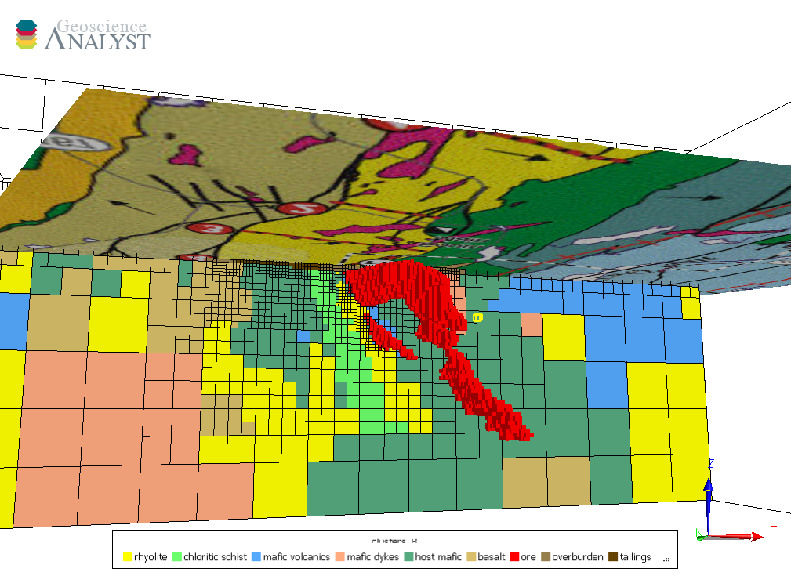

About
=====

This document contains training material for geophysical inversions using `SimPEG <https://simpeg.xyz/>`_ and `Geoscience ANALYST <https://www.mirageoscience.com/mining-industry-software/geoscience-analyst/>`_.

References
==========

.. bibliography::

.. raw:: html

    
